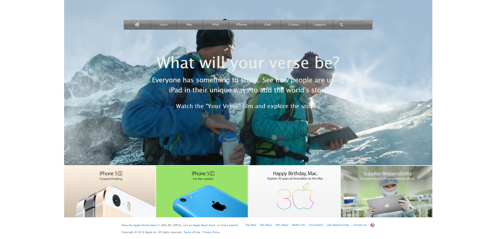

# Old-Apple-web-clone

> This is a task to clone an old apple website

## The project futures includes

- Background images
- Gradients
- Flexbox and Grid layout

## Built With

- Html
- CSS
- VSCode
- Stickler

## Live Demo

[Live Demo Link](https://johannrodriguez.github.io/Old-Apple-web-clone/.)

## Author

👤 **Author1**

- Github: [@githubhandle](https://github.com/githubhandle)
- Twitter: [@twitterhandle](https://twitter.com/twitterhandle)
- Linkedin: [linkedin](https://linkedin.com/linkedinhandle)

## 🤝 Contributing

Contributions, issues and feature requests are welcome!

Feel free to check the [issues page](issues/).

## Show your support

Give a ⭐️ if you like this project!

## Acknowledgments

- Oddin's project students submit on apple project

## 📝 License

This project is [MIT](lic.url) licensed.
